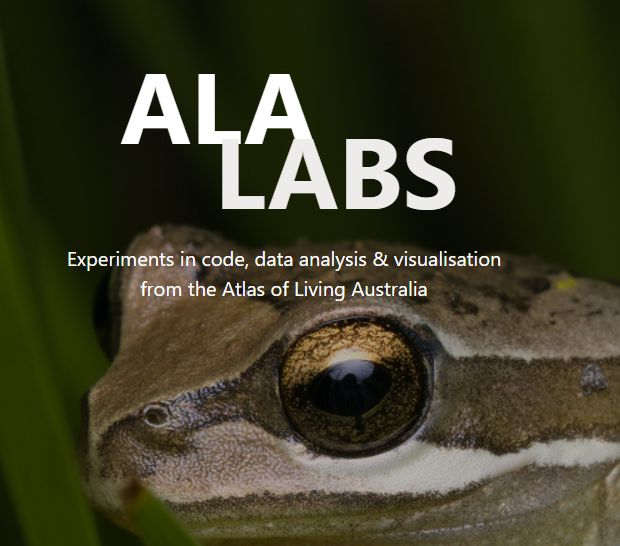

# ALA Labs 

[https://labs.ala.org.au/](https://labs.ala.org.au/)

This is the GitHub repository for the ALA Labs website. ALA Labs provides resources and articles from the Atlas of Living Australia's Science and Decision Support team. On the website, you can find:

  *  **Posts**: Code, articles, analyses and visualisations that will hopefully help you in your own work
  *  **Research**: Highlighted summaries of scientific research that has used data from the Atlas of Living Australia
  *  **Software**: R & Python packages that the Science & Decision Support team manage
  *  **Books**: Long-form resources with best-practice data wrangling and visualisation
  *  **Gallery**: Showcasing external work that uses tools from ALA Labs

We are happy to take suggestions for future posts or how-to articles. To send a suggestion, please email support@ala.org.au.
