Aboriginal and Torres Straight Islander People preserve knowledge in art and story that captures aspects of the world undocumented or recorded in any other place. They carry glimpses of the past, a view of our present, and even predictions for the future.

How do these stories overlap with data? Do the records stored in Western infrastructures like the Atlas of Living Australia reflect or contrast traditional knowledge of a given ecosystem? In this artwork, produced by Ann-Marie Keating and Gullara McInnes, proud Koko-Muluridji women of the Wallara Clan, traditional art meets Western data for a unique look at Australian biodiversity. 

::::{.cr-section}

In the far north corner of Australia, one hour west of the city of Cairns, is Mareeba; a rural Queensland town and part of Muluridji Country. 
@cr-map

:::{#cr-map}

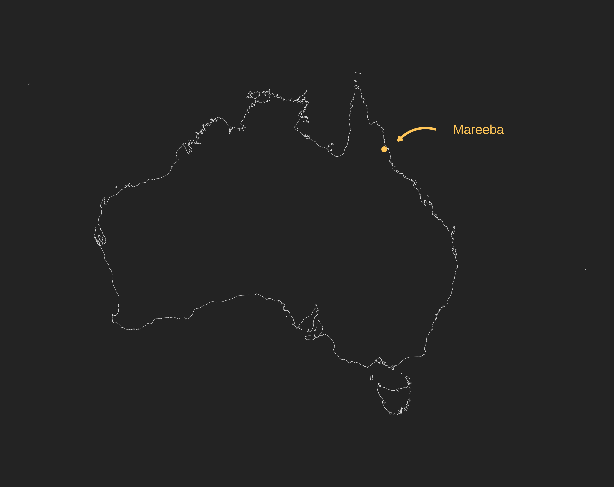{height=800}

:::
::::

:::: {.cr-section}

Here in Mareeba, lush tropical rainforest meets the beginning of the outback to create a rich ecosystem.
@cr-mareeba

:::{#cr-mareeba}

:::

::::

:::: {.cr-section}

:::{#cr-dots}
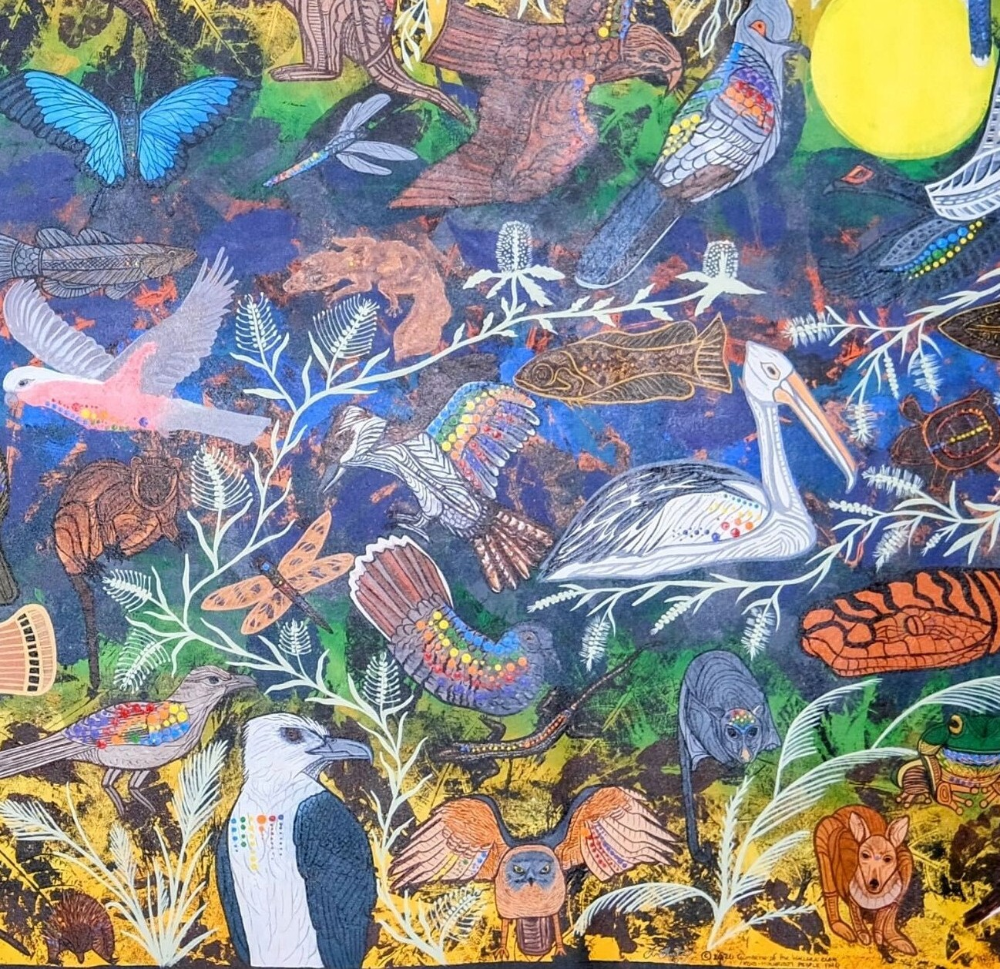{.rounded style="height:600px;width:auto;"}
:::

@cr-dots

In a unique painting, together Ann-Marie Keeting and Gullara McInnes have portrayed the biodiversity and cultural connection of Mareeba using a mix of traditional and modern art techniques.    But what makes this painting especially unique?

Actual data from the Atlas of Living Australia has been captured using traditional dot painting. In doing so, the artists have joined traditional knowledge with Western data in one singular piece.

::::

Let's explore the painting and some overarching themes as a guide to some of the cultural knowledge and inspirations in this work, with quotes from Ann-Marie Keeting.

:::: {.cr-section layout="overlay-center"}

:::{#cr-fullpainting}
{style="border-radius: 0%;"}
:::

Animals and plants are an important part of the artists' cultural identity.
@cr-fullpainting

>One of the ways we live our culture is through our animals...All of these animals in our daily life, they come and they give us messages, and so that's one way we live our culture is through our...connection to country and our connection to these animals.
@cr-fullpainting

The painting portrays day and night across the painting and both diurnal and nocturnal animals throughout the canvas. 

There is a **sun** in the top right... 
[@cr-fullpainting]{scale-by="3" pan-to="-97%, 57%"}

...and a **moon** in the bottom left.
[@cr-fullpainting]{scale-by="3" pan-to="97%, -57%"}

A **river** runs through the centre of the painting and the seasons are reflected by the colours surrounding the river.  
[@cr-fullpainting]{scale-by="2" pan-to="0%, 0%"}

>The colours in the background are the colours of our season as well. [In the middle of the painting] the [**Barron river**]{style="color:#445bc8;"} runs through here...in flood it turns [**brown**]{style="color:#bf4e1d;"}, and [across the river you have] the movement of the animals through the floods...Then [as you move towards the edge of the painting] you have the [**green flush**]{style="color:#2e9e46;"} come in and then we go back into [**drought**]{style="color:#e1c45f;"}...where the colour spreads out from the wet season back into the dry...the background [and where] the animals sit [reflects] how we connect the seasons culturally.  

::::

 

On each animal, the number, colour and size of dots summarises its real observational data on the Atlas of Living Australia (within Mareeba).

::::{.column-page-outset layout-ncol="2"}

:::{.group1}

**Dot size** corresponds to numbers of observations

{height=400}

:::

:::{.group2}

**Dot colour** corresponds to the time of year observations were recorded.

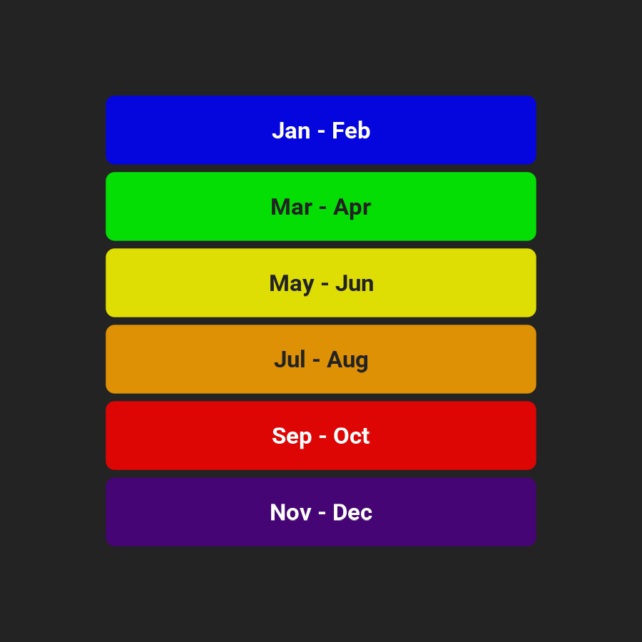{height=400}

:::
::::

You'll notice that some animals have many dots while some have very few.

 

:::: {.cr-section}
:::{#cr-dove}
{height=800}
:::
:::{#cr-birds}
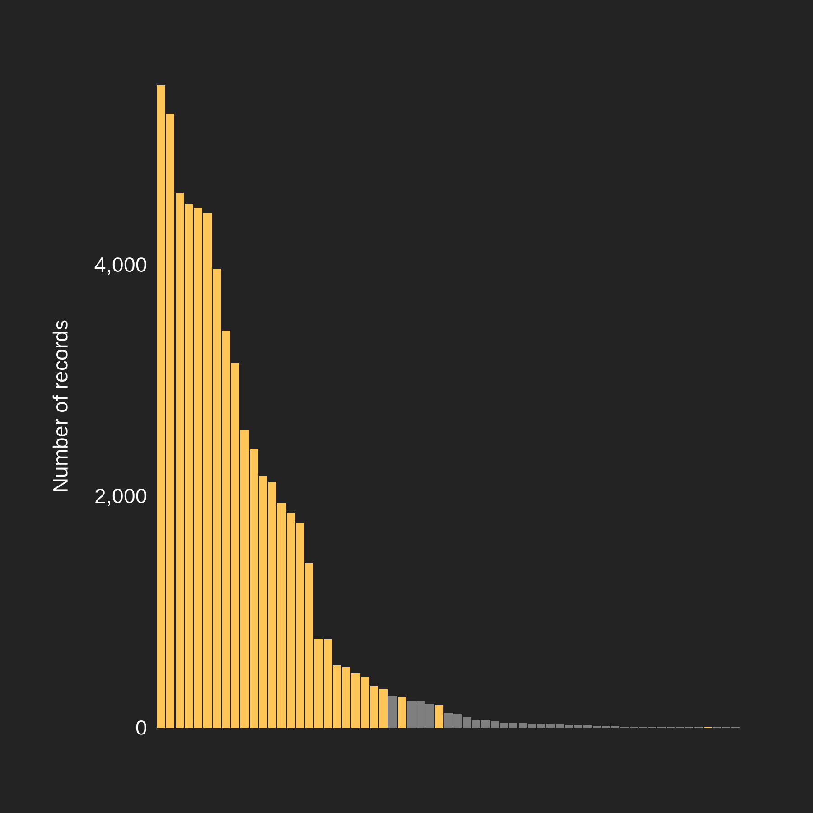{height=800}
:::
:::{#cr-dragonfly}
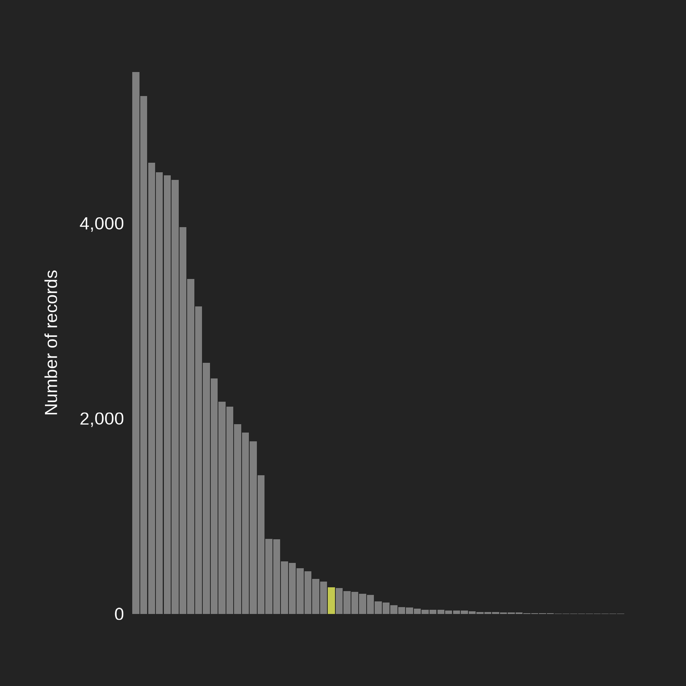{height=800}
:::
:::{#cr-fish}
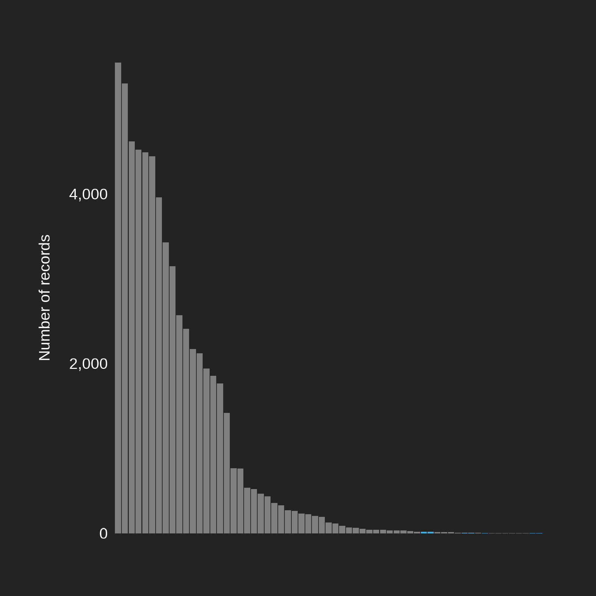{height=800}
:::

:::{#cr-other-taxa}
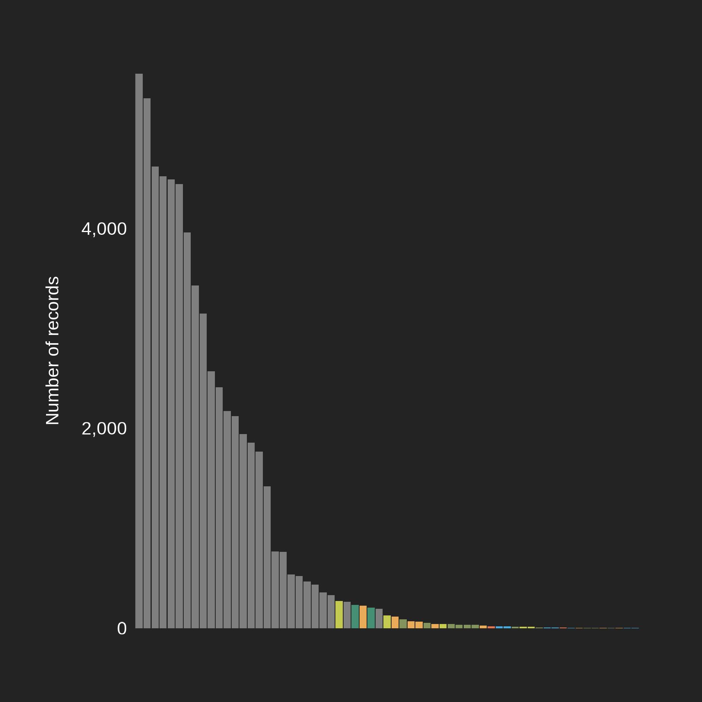{height=800}
:::

@cr-dove

:::{focus-on="cr-dove"}
:::{layout-ncol="2"}
:::{.group-1 style="margin-left: auto; margin-right:auto;margin-top:auto;margin-bottom:auto;"}

</img>

:::
:::{.group-2 style="margin-left: auto; margin-right:auto;"}
In this painting, the species with the most recorded observations in Mareeba is the [**Peaceful Dove**]{style="color:#FFC557;"} (*Geopelia placida*). As of April 2026, it has 5,551 records.
:::
:::
::::

@cr-birds

In general, [**birds**]{style="color:#FFC557;"} have more recorded observations compared to other species in this painting.

@cr-dragonfly

:::{focus-on="cr-dragonfly"}
:::{layout-ncol="2"}
:::{.group-1 style="margin-left: auto; margin-right:auto;margin-top:auto;margin-bottom:auto;"}

</img>

:::
:::{.group-2 style="margin-left: auto; margin-right:auto;"}
By comparison, the most recorded species that isn't a bird is the [**Scarlet percher**]{style="color:#C4CA50;"} (*Diplacodes haematodes*), with 274 records.

 
For every 20 records of a Peaceful Dove, there is only 1 observation of a Scarlet percher. 
:::
:::
::::

:::{focus-on="cr-dragonfly"}
:::{layout-ncol="2"}
:::{.group-1 style="margin-left: auto; margin-right:auto;margin-top:auto;margin-bottom:auto;"}

</img>

:::
:::{.group-2 style="margin-left: auto; margin-right:auto;"}
Based on Keating's knowledge of the area, this difference in observations doesn't match the true abundance of dragonflies in Mareeba.

> Before and after rain, we get a lot of insect movement, but the tell-tales are our dragonflies. We'll see different dragonflies depending on what the rain is doing. So [after] big rain, when rain has just come in, or rain is ending [is when we usually see dragonflies].

:::
:::
::::

@cr-fish

:::{focus-on="cr-fish"}
:::{layout-ncol="2"}
:::{.group-1 style="margin-left: auto; margin-right:auto;margin-top:auto;margin-bottom:auto;"}

</img>

:::
:::{.group-2 style="margin-left: auto; margin-right:auto;"}
Similarly, as flood waters recede, Keating says that many [**fish species**]{style="color:#4aacde;"} like the Long fin eel (*Anguilla reinhardtii*) and the Sleepy cod (*Oxyeleotris lineolata*) "fill up the billabong". They have also been common sources of food for the Muluridji people. 

>Our eel is one of the fish species that we give to the Elders because it is oily. The eel and the catfish are two we used to save for the elders. 

>The sleepy cod [is] in the middle [of the painting]...you can always find a sleepy cod.

However their data in the area is very limited.

:::
:::
::::

@cr-other-taxa

:::{focus-on="cr-other-taxa"}
Record numbers don't necessarily reflect *actual* abundance, but they can show us biases in the data we collect.

 
To accentuate this point, if we combined all of the records of every [**Insect**]{style="color:#C4CA50;"}, [**Amphibian**]{style="color:#458F75;"}, [**Mammal**]{style="color:#E9AB57;"}, [**Monotreme**]{style="color:#E47653;"}, [**Reptile**]{style="color:#82935B;"} and [**Fish**]{style="color:#4aacde;"} species in this painting, we have 1,874 records in total; that's only 33% of the records of the Peaceful Dove!

 
For a complex ecosystem like Mareeba's this huge difference in abundance is impossible, but what we do know is that observers seem to really like birds.
:::

::::

In Mareeba, the three most recorded birds in this painting are the Peaceful Dove (*Geopelia placida*), the Eastern Bar-shouldered Dove (*Geopelia humeralis*), and the Yellow Honeyeater (*Stomiopera flava*). 

 

:::{.column-screen}
:::{layout-ncol="3"}

:::{.group1}

</img>

 

:::{.caption style="font-size:.7rem;"}

Peaceful Dove (*Geopelia placida*) 
Dany Sloan CC-BY-NC 4.0 (Int)

:::
:::

:::{.group2}

</img>

 

:::{.caption style="font-size:.7rem;"}

Eastern Bar-shouldered Dove (*Geopelia humeralis*)  
Russell Cumming CC-BY-NC 4.0 (Int)

:::
:::

:::{.group3}

</img>

 

:::{.caption style="font-size:.7rem;"}

Yellow Honeyeater (*Stomiopera flava*) 
Anaëlle FRANCIA CC-BY-NC 4.0 (Int)

:::
:::

:::
:::

::::{.cr-section}

:::{#cr-radial-dove}
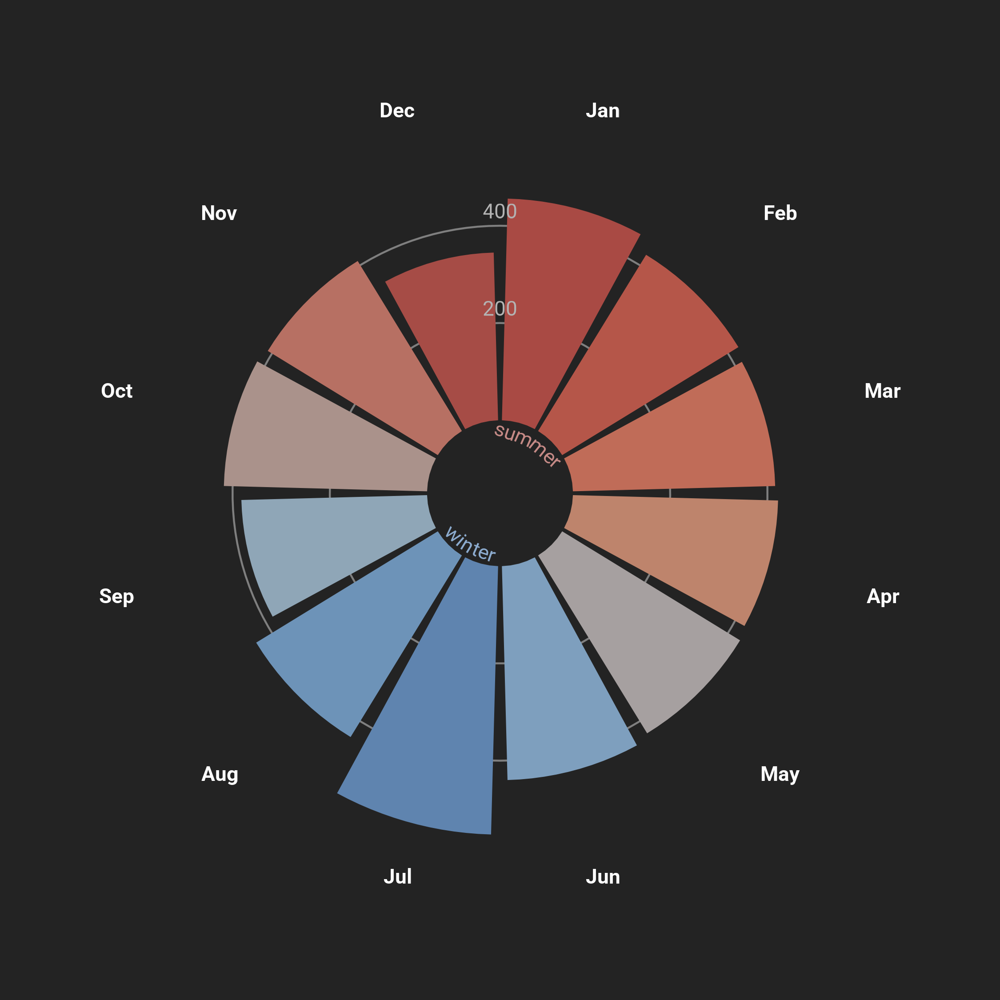{height=800}
:::

:::{#cr-radial-cockatoo}
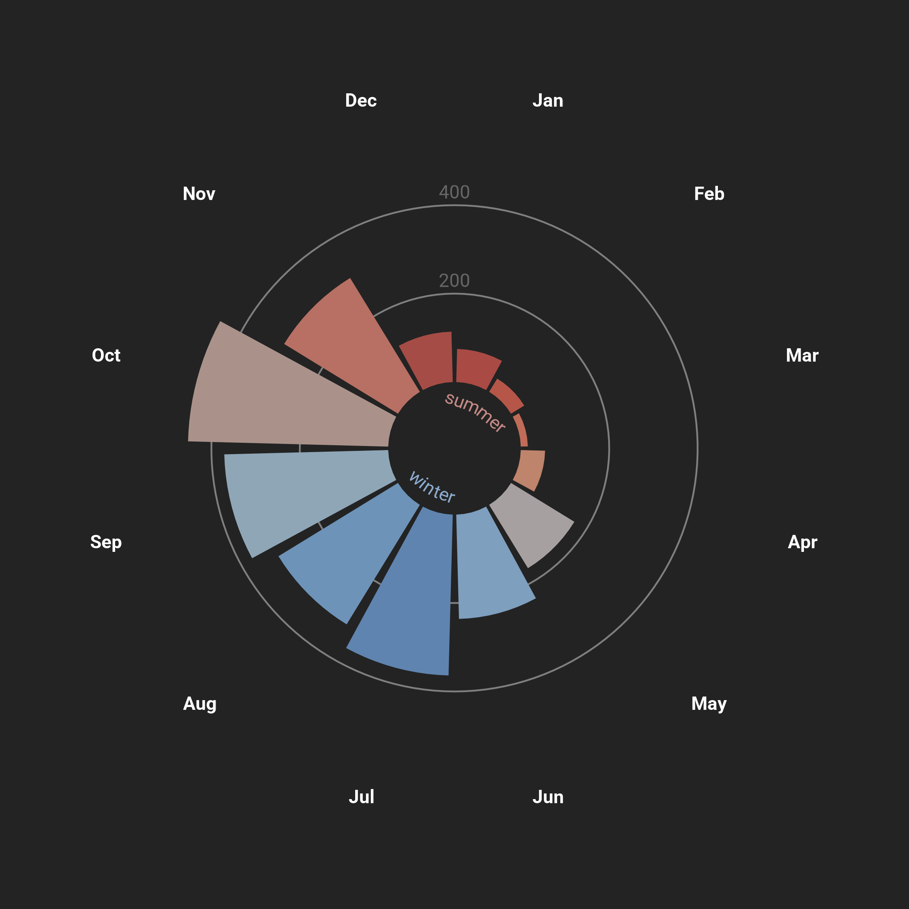{height=800}
:::

:::{#cr-radial-frog}
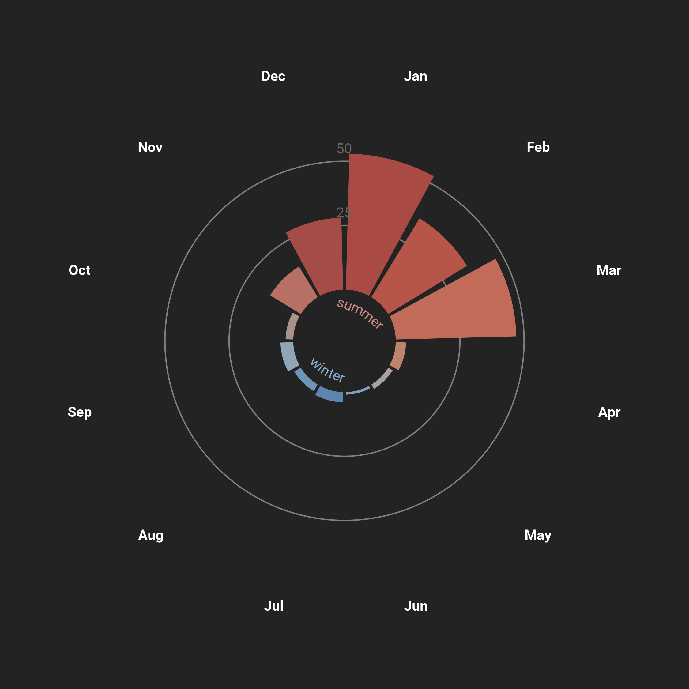{height=800}
:::

:::{#cr-bandicoot}
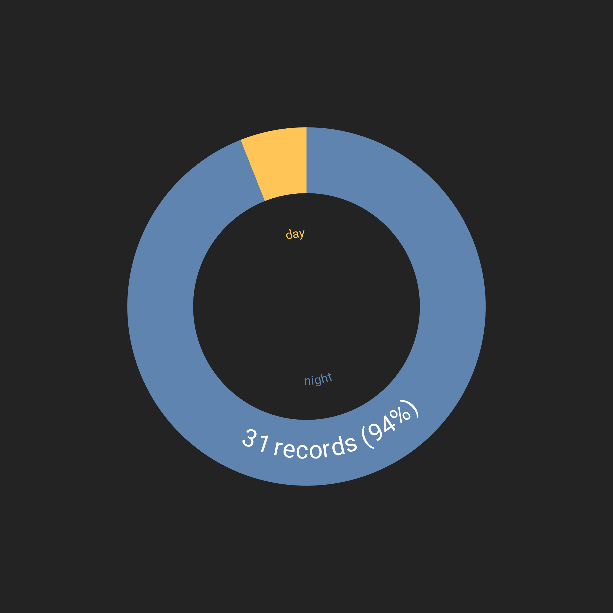{height=800}
:::

@cr-radial-dove

:::{focus-on="cr-radial-dove"}
:::{layout-ncol="2"}
:::{.group-1 style="margin-left: auto; margin-right:auto;margin-top:auto;margin-bottom:auto;"}

</img>

:::
:::{.group-2 style="margin-left: auto; margin-right:auto;"}
Two of these three birds, the Peaceful Dove and the Eastern Bar-shouldered dove, can be seen year-round. Their continuous presence in Mareeba makes it much more likely that people will incidentally observe them, which might help explain their high record numbers. Take, for example, the observations of the Eastern Bar-shouldered Dove grouped by month.
:::
:::
::::

@cr-radial-cockatoo

:::{focus-on="cr-radial-cockatoo"}
:::{layout-ncol="2"}
:::{.group-1 style="margin-left: auto; margin-right:auto;margin-top:auto;margin-bottom:auto;"}

</img>

:::
:::{.group-2 style="margin-left: auto; margin-right:auto;"}
Other birds like the Red-tailed Black Cockatoo (*Calyptorhynchus (banksii) banksii*) are much more seasonal. These cockatoos are usually more abundant in the late dry season (August) to the early wet season (October). 

> You'll find the black cockatoo will always follow the rain. He will always come behind the rain.
:::
:::
::::

@cr-radial-frog

:::{focus-on="cr-radial-frog"}
:::{layout-ncol="2"}
:::{.group-1 style="margin-left: auto; margin-right:auto;margin-top:auto;margin-bottom:auto;"}

</img>

:::
:::{.group-2 style="margin-left: auto; margin-right:auto;"}
Many species of amphibians and insects are also seasonal, occurring more frequently when conditions are hot, wet and humid at the tail end of summer. 

> Frogs are a sign of a clean environment and call in the rain to come. 

Here, observations of the Dainty Green Tree Frog (*Litoria gracilenta*) peak in late summer. 
:::
:::
::::

@cr-bandicoot

:::{focus-on="cr-bandicoot"}
:::{layout-ncol="2"}
:::{.group-1 style="margin-left: auto; margin-right:auto;margin-top:auto;margin-bottom:auto;"}

</img>

:::
:::{.group-2 style="margin-left: auto; margin-right:auto;"}
Some species in this painting like the Northern brown bandicoot (*Isoodon macrourus*) are also nocturnal, primarily active at [**night**]{style="color:#5F84AF;"} instead of [**day**]{style="color:#FFC557;"}. This makes it less likely that people see and record these species, reducing record numbers.
:::
:::
::::

::::

Birds hold great significance to Keating and her family.

> There's a lot of birds in here because I belong to birds...If I can't paint a bird nicely I'm disgracing myself!

Birds like the Magpie Goose hold particular significance to Keating's child Kimkahgulli. 

>My youngest child, her name is Kimkahgulli [which] means the single call of a magpie goose. So you can see the magpie goose sits in an area of prominence.

:::{.column-page}
:::{layout-ncol="2" layout="[1,2]]"}
:::{.group-1 style="margin-left: auto; margin-right:auto;margin-top:auto;margin-bottom:auto;"}

</img>

:::
:::{.group-2 style="margin-left: auto; margin-right:auto;margin-top:auto;margin-bottom:auto;"}

</img>

:::{.caption style="font-size:.7rem;"}

Magpie Goose (*Anseranas semipalmata*)  
Ben CC-BY-NC-ND 4.0 (Int)

:::
:::
:::
:::

Many animals depicted in the painting also hold great cultural significance to the Muluridji people, like the Carpet Python, the Tawny Frogmouth and the Bush Stone Curlew.

[more photos?]

Hear more about this painting and the Muluridji people's cultural connection to these animals from Ann-Marie Keating:



By combining Western data with Indigenous culture, Keating and McInnes have provided a unique look at the diversity of Muluridji Country. They have also highlighted the disparity that exists between local knowledge and observational data. Despite its usefulness, Western data alone cannot always paint a complete picture of an area. The long history that Indigenous people live on Country is essential for conservation. The hope is that the Muluridji people continue to preserve and share their cultural knowledge, providing a more complete picture of Mareeba's ecosystem.

<!-- :::::{style="--cr-narrative-sidebar-width: 3fr;"} -->
<!-- ::::{.cr-section} -->
<!-- :::: -->
<!-- ::::: -->

<!--

Some birds hold great cultural significance to the Muluridji people and Keating's family. Forest kingfishers are a good omen.

Magpie larks are 'the defenders'. When there is an intruder with bad intentions, they will sing out.

The Bush Stone Curlew warns that an argument or, for Keating, when her children might cause trouble. Long, sad calls close to the house can mean that a family member has passed away.

The Tawny Frogmouth is a bad omen, warning of death or bad injury.

Despite their importance to the ecosystem, the painting highlights that fish, reptiles, amphibians and insects have far fewer records than birds in the Atlas of Living Australia. This data bias can be for many reasons. Some species are easier to see due to their colour, size, life cycle or personality. Some species might be more popular to look for and record. Some species can live in places that are hard to access or out of view. Let's look at a few interesting species and compare their record numbers to that of our most recorded bird, xxx.

The carpet python pays homage to the Muluridji people's two dreaming serpents that travel along the Barron River and Granite Creek. This huge species of snake is only recorded xxxx times compared to xxx bird.

As flood waters recede, Keating says that many fish species fill up the billabongs. However, species like the xxxx have only xxx percent as many records as [the most recorded bird].

Larger frogs the Australian Green tree frog are some of the most recorded species in the area.

According to Keating, various dragonfly species appear around the rains. The Scarlet Percher appears before the rains arrive...

...and the Blue skimmer dragon fly appears when the rains are leaving.

 

There are a total of 62 animals on this painting, including xxxx birds.  \\
> There's a lot of birds in here because I belong to birds...If I can't paint a bird nicely I'm disgracing myself!

My youngest child, her name is Kimfgully [which] means the single call of a magpie goose. So you can see the magpie goose sits in an area of prominence.

We also have the wedgetail eagle, it has greater significance to my son. We live on a farm outside of town and when he was probably about 6, he was---in his words---nearly eaten by a wedgetail eagle. It was circling above him and we could hear the screams from the house. It was very close to him, I must admit, but yes the sheer look at fear that he was going to get eaten by a wedgetail eagle was unforgettable.

Cluster fig and bottle brush in the background

The original art style I used was a single line and a patterning, and the evolution of it is that I've added colour and patterning...I've changed the way the animals sit...between there being a side or aerial view, I've tried to make them move, so their positions might be how you see them naturally rather than in a flat state.

The curlew does not have the [lined patterns] as the others because we were too afraid to touch it [and] because its portrait was absolutely beautiful...we didn't want to disgrace it by adding colour. 
For my family specifically, the tawny frogmouth is held in high regard. Even as an image I will not point at it and bring myself bad luck...photos of things can bring bad luck, but also painting them in a bad way can bring bad luck...when I paint I am mindful and respectful to the animal I am painting so that I'm not jinxed in any way. Some of [the animals] might be bigger or smaller or even more beautiful because [they have] cultural significance.

[This painting and the menagerie style of painting] is one way of preserving our culture.

The animals have many layers of significance. Not just messages, they also represent our families. They will tell us what's going on in Country in different areas. If there's something bad that's happening in [an area] that I need to look at, the crow will...fly in that direction and tell me what I should be doing. Between how we live our culture with our animals, our animals will tell us what is happening on our Country.

The quoll is very rare to see which is why it's in the middle, kind of by itself.

Plants and animals tell us the seasons. 
You'll find the black cockatoo will always follow the rain. He will always come behind the rain.
Kingfisher, he's our little good luck messenger. Everytime I see him, good things will happen to the family. You'll normally see him [where] the prominence of insects are.
Before and after rain, we get a lot of insect movement, but the tell tales are our dragonflies. We'll see different dragonflies depending on what the rain is doing. So big rain, when rain has just come in or rain is ending [is when we see dragonflies]
Our koalas, they're known to be on the Athaden table lands. 
Our eel is one of the fish species that we give to the Elders because it is oily. The eel and the catfish are two we used to save for the elders. 
The sleepy cod in the middle, you can always find a sleepy cod

-->
