Through art and story, Aboriginal and Torres Strait Islander People capture deep connections and rich knowledge in nature that may not be documented or recorded. This traditional knowledge carries glimpses of the past, a view of our present, and even predictions for the future.

How does traditional knowledge overlap with Western-collected data? Do the records stored in infrastructures like the Atlas of Living Australia (ALA) reflect or contrast traditional knowledge of a given ecosystem? 

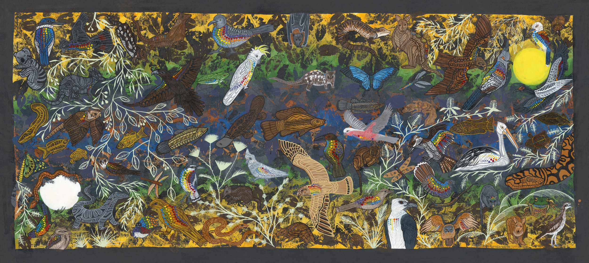

 

Continue scrolling to explore the story of this artwork and the data interwoven through it.

::::{.cr-section}

In the far north corner of Australia, one hour west of the city of Cairns, is Mareeba; a rural Queensland town and part of Muluridji Country. 
@cr-map

:::{#cr-map}

{width=auto style="max-height:800px;"}

:::
::::

:::: {.cr-section}

Here in Mareeba, lush tropical rainforest meets the beginning of the outback to create a rich ecosystem.
@cr-mareeba

:::{#cr-mareeba}

:::

::::

:::: {.cr-section}

:::{#cr-dots}
{.rounded style="height:auto;width:auto;max-height:600px"}
:::

In a collaborative painting, Keating and McInnes have portrayed the biodiversity and cultural connection of Mareeba using a mix of traditional and modern art techniques.    But what makes this painting unique?
@cr-dots

For the first time, data from the Atlas of Living Australia has been incorporated using traditional dot painting techniques. In doing so, the artists have joined traditional knowledge with Western data on one canvas.

::::

Let's explore the painting and some overarching themes as a guide to some of the cultural knowledge and inspirations in this work, with quotes from Ann-Marie Keating.

:::: {.cr-section layout="overlay-center"}

:::{#cr-fullpainting}
{style="border-radius: 0%;"}
:::

Animals and plants are an important part of the artists' cultural identity.
@cr-fullpainting

>One of the ways we live our culture is through our animals...All of these animals in our daily life, they come and they give us messages, and so that's one way we live our culture is through our...connection to Country and our connection to these animals.
@cr-fullpainting

The painting portrays day and night and both diurnal and nocturnal animals throughout the canvas. 

There is a **sun** in the top right... 
[@cr-fullpainting]{scale-by="3" pan-to="-97%, 57%"}

...and a **moon** in the bottom left.
[@cr-fullpainting]{scale-by="3" pan-to="97%, -57%"}

A **river** runs through the centre of the painting and the seasons are reflected by the colours surrounding the river.  
[@cr-fullpainting]{scale-by="2" pan-to="0%, 0%"}

>The colours in the background are the colours of our season as well. [In the middle of the painting] the [**Barron river**]{style="color:#445bc8;"} runs through here...in flood it turns [**brown**]{style="color:#bf4e1d;"}, and [across the river you have] the movement of the animals through the floods...Then [as you move towards the edge of the painting] you have the [**green flush**]{style="color:#2e9e46;"} come in and then we go back into [**drought**]{style="color:#e1c45f;"}...where the colour spreads out from the wet season back into the dry...the background [and where] the animals sit [reflects] how we connect the seasons culturally.  
[@cr-fullpainting]{scale-by="1" pan-to="0%, 0%"}

::::

 

The number, colour and size of painted dots on each animal represents the observational data for each species in the Atlas of Living Australia (within Mareeba).

::::{.column-page-outset layout-ncol="2"}

:::{.group1}

**Dot size** corresponds to numbers of observations, so bigger dots represent more observations.

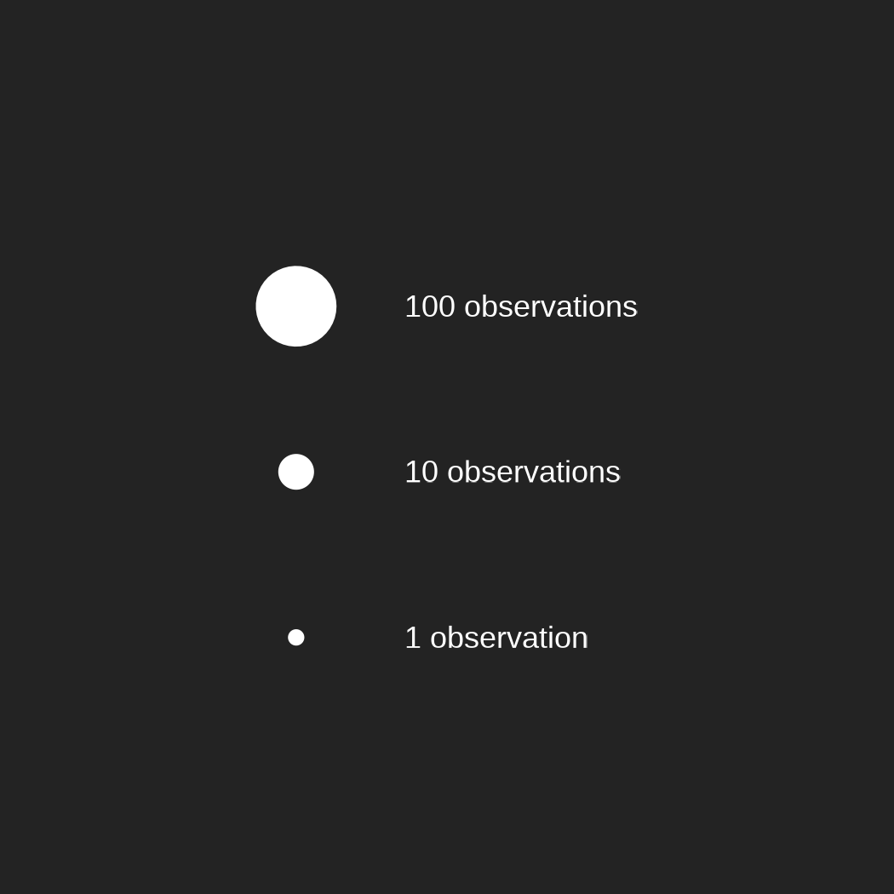{style="max-height:400px; height:auto; width:auto;"}

:::

:::{.group2}

**Dot colour** corresponds to the time of year observations were recorded.

{style="max-height:400px; height:auto; width:auto;"}

:::
::::

You'll notice that some animals have many dots while some have very few.

 

:::: {.cr-section}
:::{#cr-dove}
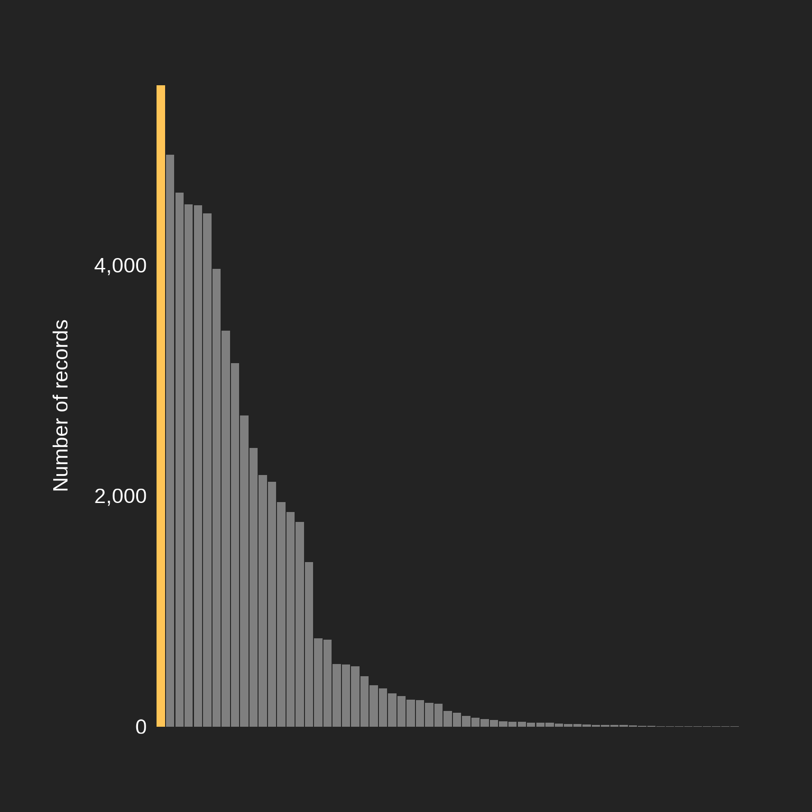{width=auto style="max-height:800px;"}
:::
:::{#cr-birds}
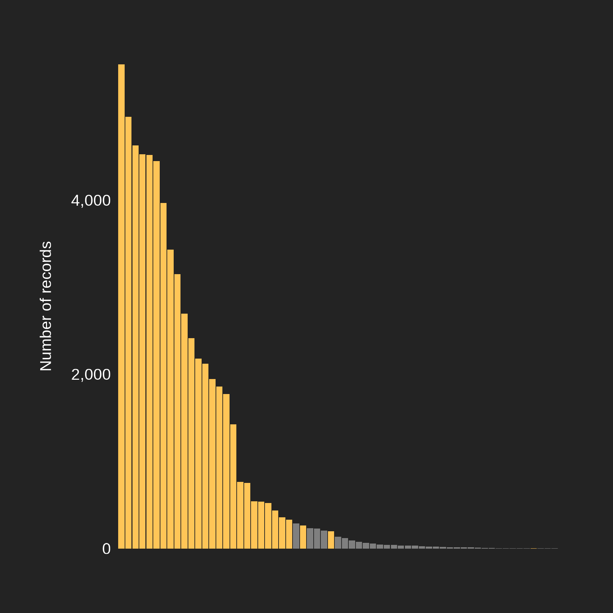{width=auto style="max-height:800px;"}
:::
:::{#cr-dragonfly}
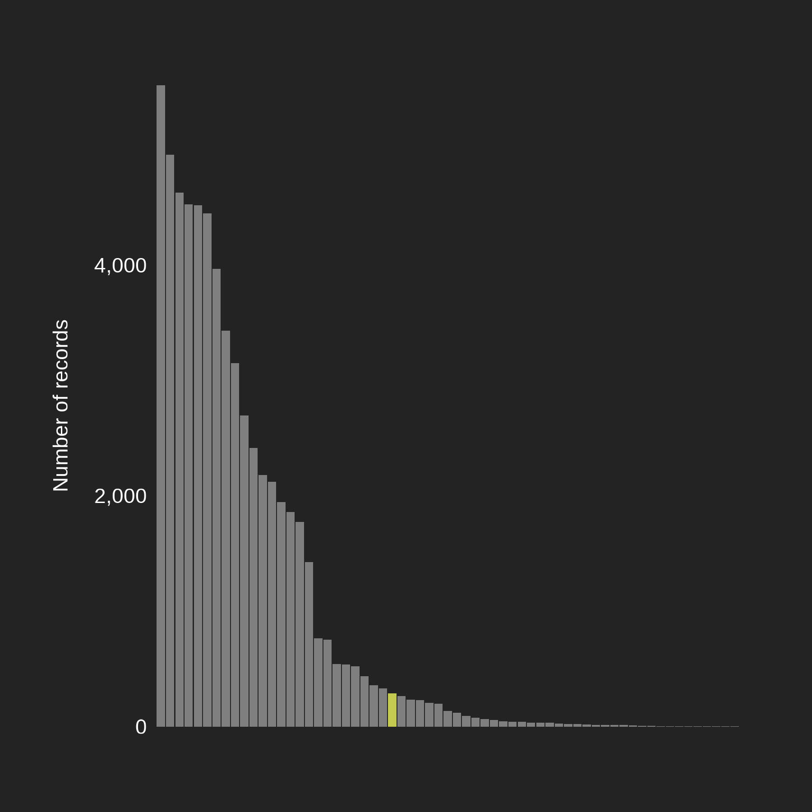{width=auto style="max-height:800px;"}
:::
:::{#cr-fish}
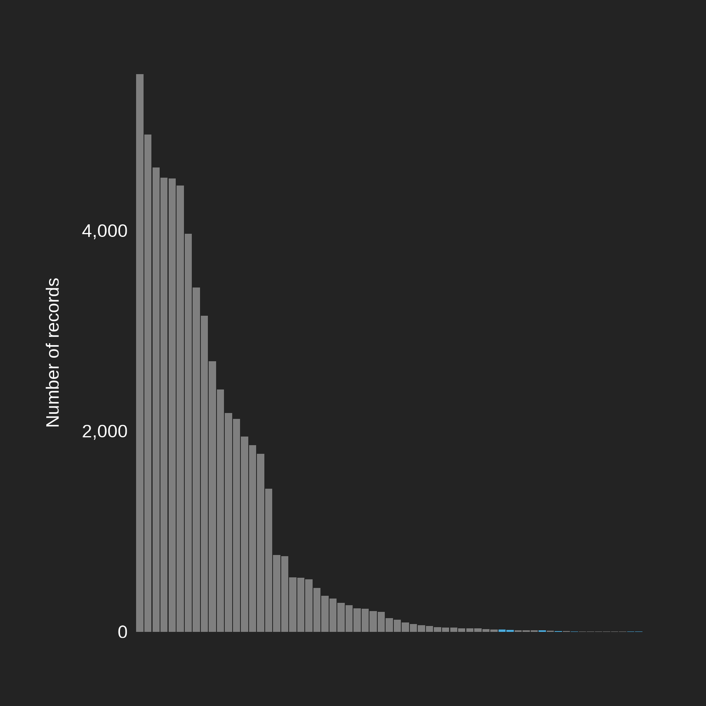{width=auto style="max-height:800px;"}
:::

:::{#cr-other-taxa}
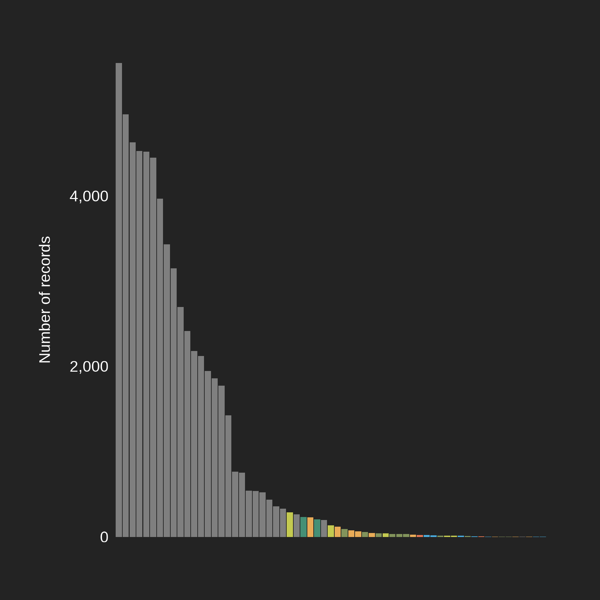{width=auto style="max-height:800px;"}
:::

@cr-dove

:::{focus-on="cr-dove"}
:::{layout-ncol="2"}
:::{.group-1 style="margin-left: auto; margin-right:auto;margin-top:auto;margin-bottom:auto;"}

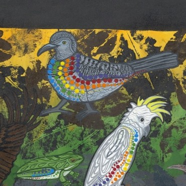</img>

:::
:::{.group-2 style="margin-left: auto; margin-right:auto;"}
In this painting, the species with the most recorded observations in Mareeba is the [**Peaceful Dove**]{style="color:#FFC557;"} (*Geopelia placida*). As of August 2026, it has 5,431 records.
:::
:::
::::

@cr-birds

In general, [**birds**]{style="color:#FFC557;"} have more recorded observations compared to other species in this painting.

@cr-dragonfly

:::{focus-on="cr-dragonfly"}
:::{layout-ncol="2"}
:::{.group-1 style="margin-left: auto; margin-right:auto;margin-top:auto;margin-bottom:auto;"}

</img>

:::
:::{.group-2 style="margin-left: auto; margin-right:auto;"}
By comparison, the most recorded species that isn't a bird is the [**Scarlet percher**]{style="color:#C4CA50;"} (*Diplacodes haematodes*), with 289 records.

 
In Mareeba, for every ~20 records of a Peaceful Dove there is only 1 record of a Scarlet percher on the ALA. 
:::
:::
::::

:::{focus-on="cr-dragonfly"}
:::{layout-ncol="2"}
:::{.group-1 style="margin-left: auto; margin-right:auto;margin-top:auto;margin-bottom:auto;"}

</img>

:::
:::{.group-2 style="margin-left: auto; margin-right:auto;"}
Based on Keating's knowledge of the area, this difference in observations doesn't match the true abundance of dragonflies in Mareeba.

> Before and after rain, we get a lot of insect movement, but the tell-tales are our dragonflies. We'll see different dragonflies depending on what the rain is doing. So [after] big rain, when rain has just come in, or rain is ending [we usually see dragonflies].

:::
:::
::::

@cr-fish

:::{focus-on="cr-fish"}
:::{layout-ncol="2"}
:::{.group-1 style="margin-left: auto; margin-right:auto;margin-top:auto;margin-bottom:auto;"}

</img>

:::
:::{.group-2 style="margin-left: auto; margin-right:auto;"}
Similarly, as flood waters recede, Keating says that many [**fish species**]{style="color:#4aacde;"} like the Long fin eel (*Anguilla reinhardtii*) and the Sleepy cod (*Oxyeleotris lineolata*) "fill up the billabong". They have also been common sources of food for the Muluridji people. 

>Our eel is one of the fish species that we give to the Elders because it is oily. The eel and the catfish are two we used to save for the elders. 

>The sleepy cod [is] in the middle [of the painting]...you can always find a sleepy cod.

However fish data in the area is very limited on the ALA.

:::
:::
::::

@cr-other-taxa

:::{focus-on="cr-other-taxa"}
It's important to remember that record numbers don't necessarily reflect *actual* abundance, but they can show us biases in the data we collect.

 
To accentuate this point, when we combine all of the records of every [**Insect**]{style="color:#C4CA50;"}, [**Amphibian**]{style="color:#458F75;"}, [**Mammal**]{style="color:#E9AB57;"}, [**Monotreme**]{style="color:#E47653;"}, [**Reptile**]{style="color:#82935B;"} and [**Fish**]{style="color:#4aacde;"} species in this painting, we have 1,952 records in total; that's only 36% of the records of the Peaceful Dove!

 
For a complex ecosystem like Mareeba's, the impression given by the data doesn't reflect reality---it would be impossible that there are actually that many more birds than other species. A healthy ecosystem couldn't exist without all those other species breaking down and cycling nutrients! These record numbers highlight how little data we still have of some taxonomic groups in Australia. They also show just how much observers seem to really like birds (and that's a good thing for birds)!
:::

::::

In Mareeba, the three most recorded birds in this painting are the Peaceful Dove (*Geopelia placida*), the Eastern Bar-shouldered Dove (*Geopelia humeralis*), and the Yellow Honeyeater (*Stomiopera flava*). 

 

:::{.column-screen}
:::{layout-ncol="3"}

:::{.group1 style="margin-left: auto; margin-right:auto;margin-top:auto;margin-bottom:auto;"}

</img>

 

:::{.caption style="font-size:.7rem;"}

Peaceful Dove (*Geopelia placida*) 
Dany Sloan CC-BY-NC 4.0 (Int)

:::
:::

:::{.group2 style="margin-left: auto; margin-right:auto;margin-top:auto;margin-bottom:auto;"}

</img>

 

:::{.caption style="font-size:.7rem;"}

Eastern Bar-shouldered Dove (*Geopelia humeralis*)  
Russell Cumming CC-BY-NC 4.0 (Int)

:::
:::

:::{.group3 style="margin-left: auto; margin-right:auto;margin-top:auto;margin-bottom:auto;"}

</img>

 

:::{.caption style="font-size:.7rem;"}

Yellow Honeyeater (*Stomiopera flava*) 
Anaëlle FRANCIA CC-BY-NC 4.0 (Int)

:::
:::

:::
:::

::::{.cr-section}

:::{#cr-radial-dove}
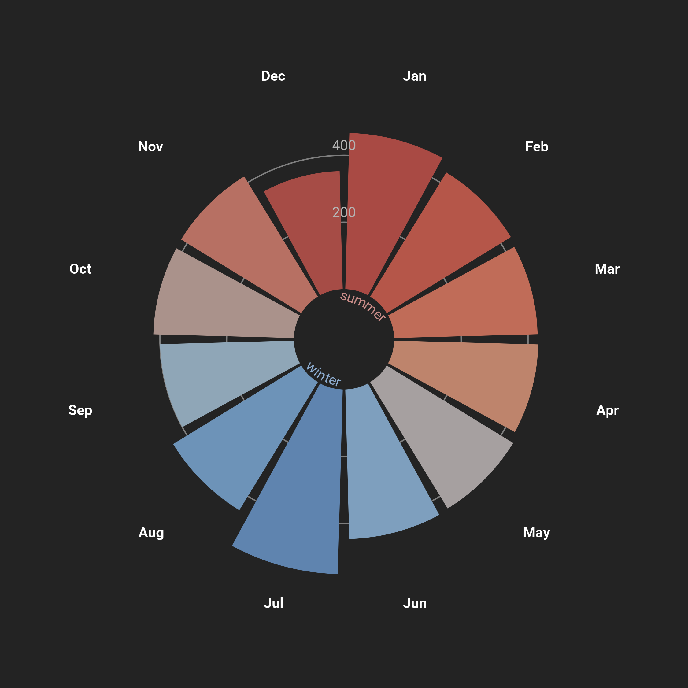{width=auto style="max-height:800px;"}
:::

:::{#cr-radial-cockatoo}
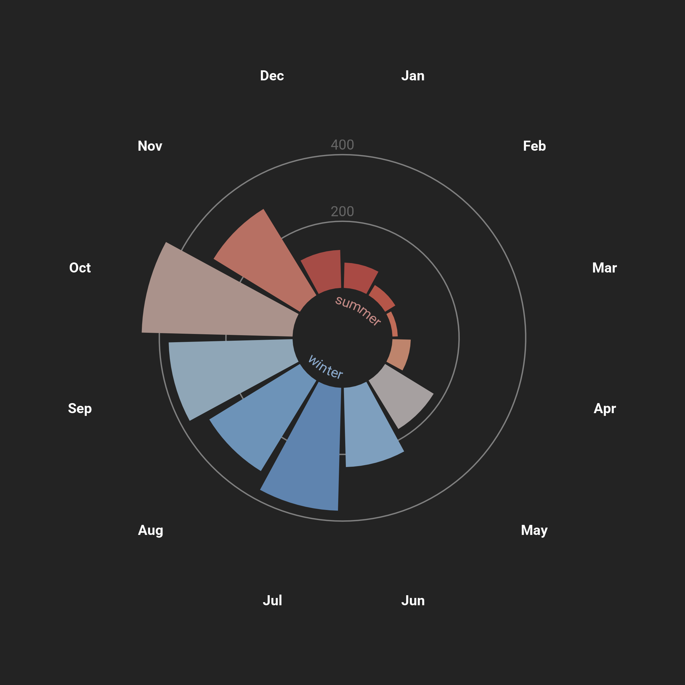{width=auto style="max-height:800px;"}
:::

:::{#cr-radial-frog}
{width=auto style="max-height:800px;"}
:::

:::{#cr-bandicoot}
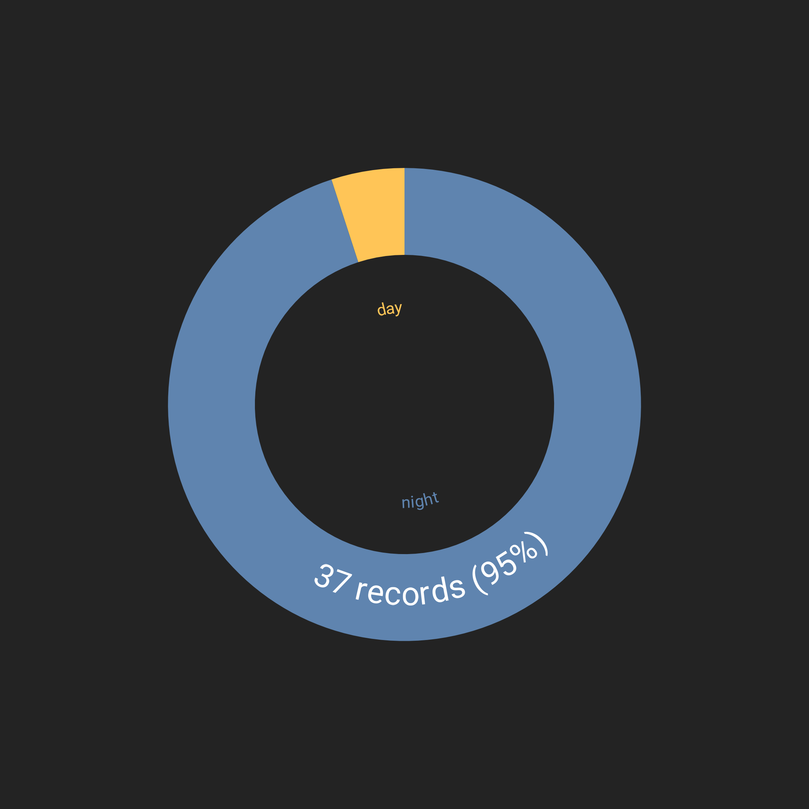{width=auto style="max-height:800px;"}
:::

:::{focus-on="cr-radial-dove"}
:::

:::{focus-on="cr-radial-dove"}
:::{layout-ncol="2"}
:::{.group-1 style="margin-left: auto; margin-right:auto;margin-top:auto;margin-bottom:auto;"}

</img>

:::
:::{.group-2 style="margin-left: auto; margin-right:auto;"}
Two of these three birds, the Peaceful Dove and the Eastern Bar-shouldered dove, can be seen year-round. Take, for example, observations of the Eastern Bar-shouldered Dove grouped by month. 

 
Their continuous presence in Mareeba makes it much more likely that people will incidentally observe them, which might help explain their high record numbers. 
:::
:::
::::

@cr-radial-cockatoo

:::{focus-on="cr-radial-cockatoo"}
:::{layout-ncol="2"}
:::{.group-1 style="margin-left: auto; margin-right:auto;margin-top:auto;margin-bottom:auto;"}

</img>

:::
:::{.group-2 style="margin-left: auto; margin-right:auto;"}
Other birds like the Red-tailed Black Cockatoo (*Calyptorhynchus (banksii) banksii*) are much more seasonal. These cockatoos are usually more abundant in the late dry season (August) to the early wet season (October). 

> You'll find the black cockatoo will always follow the rain. He will always come behind the rain.
:::
:::
::::

@cr-radial-frog

:::{focus-on="cr-radial-frog"}
:::{layout-ncol="2"}
:::{.group-1 style="margin-left: auto; margin-right:auto;margin-top:auto;margin-bottom:auto;"}

</img>

:::
:::{.group-2 style="margin-left: auto; margin-right:auto;"}
Many species of amphibians and insects are also seasonal, occurring more frequently when conditions are hot, wet and humid at the tail end of summer. 

> Frogs are a sign of a clean environment and call in the rain to come. 

Here, observations of the Dainty Green Tree Frog (*Litoria gracilenta*) peak in late summer. 
:::
:::
::::

@cr-bandicoot

:::{focus-on="cr-bandicoot"}
:::{layout-ncol="2"}
:::{.group-1 style="margin-left: auto; margin-right:auto;margin-top:auto;margin-bottom:auto;"}

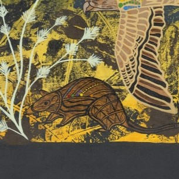</img>

:::
:::{.group-2 style="margin-left: auto; margin-right:auto;"}
Some species in this painting like the Northern brown bandicoot (*Isoodon macrourus*) are also nocturnal, primarily active at [**night**]{style="color:#5F84AF;"} instead of [**day**]{style="color:#FFC557;"}. This makes it less likely that people see and record these species, reducing record numbers. In this case, there are only 39 records of Northern brown bandicoots in Mareeba.
:::
:::
::::

::::

Hear more about the inspirations and cultural knowledge in this painting from artist Ann-Marie Keating in the following video:  

:::{.column-page-outset}



:::

  

View the full painting below:

:::{.column-screen}

{.lightbox}

:::

By combining Western data with Indigenous knowledge, Keating and McInnes have provided a unique look at the diversity of Muluridji Country. They have also highlighted the disparity that exists between local knowledge and observational data. Despite its usefulness, Western data alone cannot always paint a complete picture of an area, as it doesn't always depict biodiversity equally. 

The long history that Indigenous people carry through their traditions and connection to Country offers essential knowledge for conservation. As the painting suggests, combining traditional knowledge and Western knowledge may provide unique insights necessary for preserving ecosystems into the future. 

Our thanks to Ann-Marie Keating and Gullara McInnes for sharing their cultural connection, and that of the Muluridji people, with us.

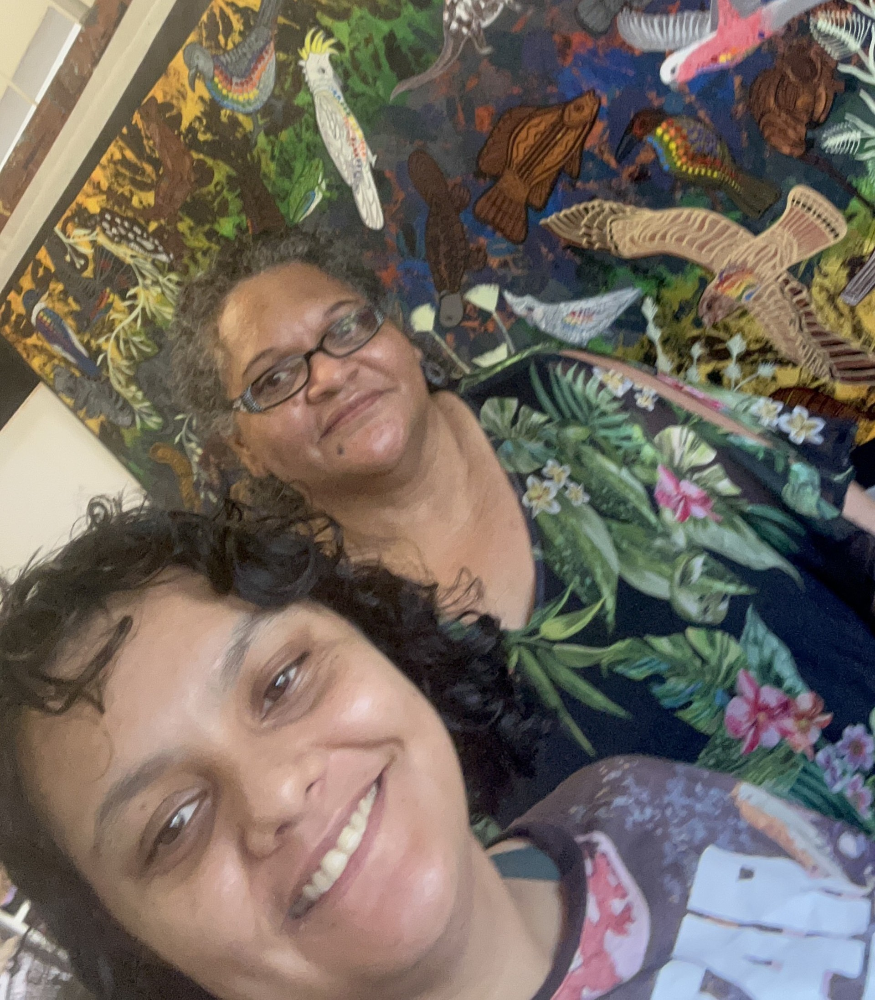{width=70%}

***

<!-- Author card -->

:::::: author-card-dark
::: author-card-text
#### Author

Dax Kellie

#### Date

14 August 2026
:::

::: author-card-image
::: {layout-ncol="1" style="margin-left: auto; margin-right: auto;"}
</img>
:::
:::
::::::
